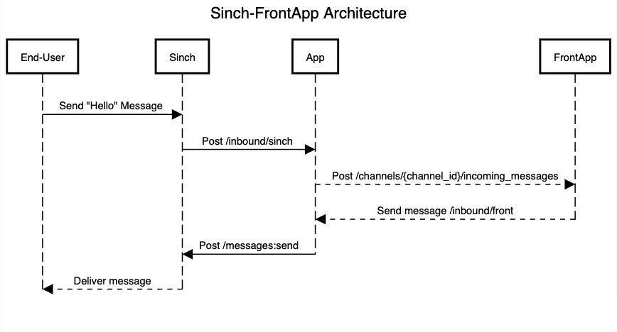
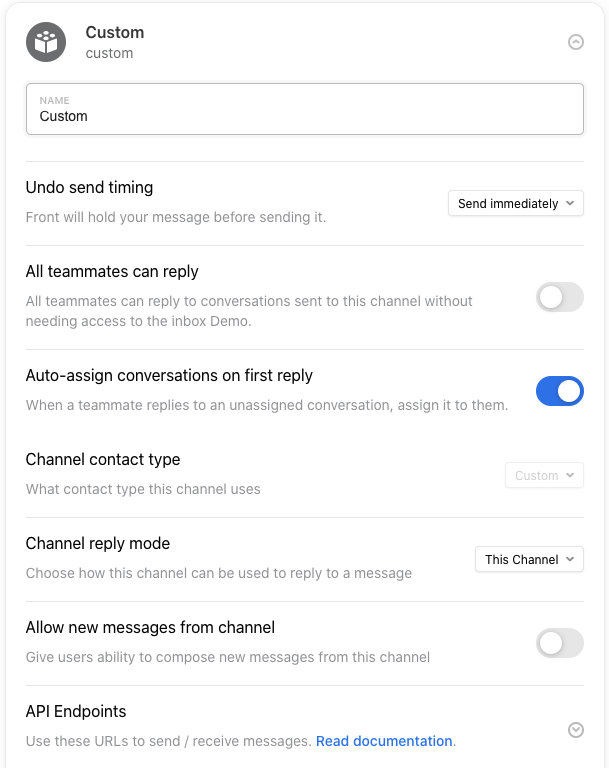
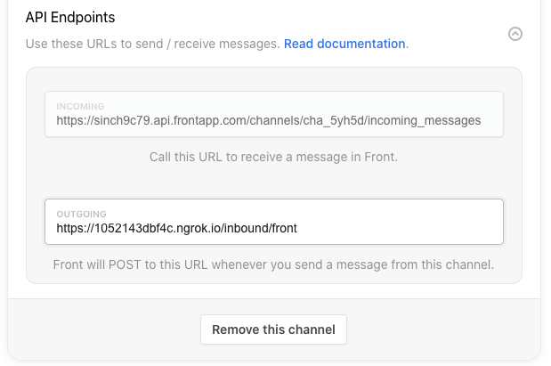

## Purpose

FrontApp (https://frontapp.com/) is a cloud-based customer communication platform that allows you to collaborate, comment, assign, and respond to your customers’ support needs -- all from the convenience of one inbox regardless of which mobile messaging channels your customers are using.

This demo supports sending and receiving of text messages and media messages (image only) to and from your customers for customer engagement and support. In addition, it will show how you can save time by using FrontApp and Sinch Conversation API to configure one custom channel to assist your customers who are using SMS and Facebook Messenger all while having a single inbox for them.
 
## Features Supported Using This Tutorial 

Using their phones, your customers (end-users) can send messages to you using SMS and Facebook Messenger messaging channels. When you receive the request, you can then respond back to your customers using text via SMS and Facebook Messenger channels from one inbox.

## Disclaimer 

This integration demo does not allow you to initiate a message to your customer and instead limits your responses to their incoming requests. When using multiple channels with a single inbox in FrontApp, and composing a new outbound message, FrontApp currently does not allow you to specify which messaging channel ought to be used to send this message.

As the Conversation API supports multiple channels, you need to specify which channel to be used as a preferred channel and which channel to be used as a backup so that the integration will work as desired. In absence of not able to getting this input from FrontApp, for the purpose of this demo, the ability to compose a new message in FrontApp has been turned off.

## Assumptions
This demo assumes that you have a fully configured Sinch App on Sinch Dashboard. To know more detail, please visit https://developers.sinch.com/docs/conversation-getting-started to understand more about different specs such as **app_id**, **client_id**, **client_secret**, **project_id**, **project_region**. 

## 🧐 What's inside?

Here are the top-level files and directories:

```text
frontApp
├── config.js
├── index.js
├── .gitignore
├── package-lock.json
├── package.json
├── local.js
├── diagram.md
└── README.md
```

1.  **`config.js`**: A file that contains all environment variables that are needed for this project to be functioning.

2.  **`index.js`**: A file that contains the API controller and logic to exchange messages between Sinch and FrontApp.

3.  **`.gitignore`**: This file tells git which files it should not track and maintain a version history for.

4.  **`package-lock.json`** (See `package.json` below, first). This is an automatically generated file based on the exact version of your npm dependencies that were installed for your project. **(You won’t change this file directly).**

5.  **`package.json`**: A manifest file for Node.js projects, which includes things like metadata (the project’s name, author, etc.). This manifest is how npm knows which packages to install for your project.

6.  **`local.js`**: You can use this script to run a development environment where you do not need to configure ngrok and the webhook to Sinch Dashboard.

7.  **`diagram.md`**: A text file containing the architecture code.

8.  **`README.md`**: A text file containing useful reference information about your project.

## Architecture



1.  **`FrontApp`**: When a new message is received from Sinch, FrontApp is the actor to whom this Sinch App will forward to the message to. This will allow FrontApp users to see the message(s) on FrontApp inboxes. During delivery of outbound mobile messages from FrontApp, these will be received by Sinch App and then the Sinch App will forward to Sinch Messaging Server.

2.  **`Sinch`**: Sinch refers to Sinch Messaging Server. Here Sinch is the actor that this App will send the message to and Sinch will deliver that message to end-user(s).

3.  **`App`**: This is Sinch demo app that handles the logic for exchanging the messages between two parties (Sinch and FrontApp).

4.  **`End-User`**: The user on their device who sends the message(s) to FrontApp as well as receives the messages from FrontApp.

## 🚀 Quick start

There are two ways to run the App.

1.  **Run app with index.js**

    If you run with index.js, you will need to set up ngrok and the webhook to Sinch Dashboard. Please follow the below instructions.

    ```shell
    cd plugins/frontApp
    npm install
    npm run start
    ```

2.  **Run app with local.js**

    If you run with local.js, you will **not** need to set up ngrok and Sinch webhook, everything is taken care of for you.

    ```shell
    cd plugins/frontApp
    npm install
    npm run dev
    ```

## Environment variables

1. **`FRONT_APP_INCOMING_URI`**: The URI that the App needs to send message(s) to FrontApp.

2. **`FRONT_APP_TOKEN`**: FrontApp Authentication Token.

3. **`SINCH_APP_ENVIRONMENT`**: The region in which your Sinch App is located (EU, US).

4. **`SINCH_APP_PROJECT_ID`**: The Project ID of your Sinch App.

5. **`SINCH_APP_APP_ID`**: TThe App ID of your Sinch App.

6. **`SINCH_APP_CLIENT_ID`**: The Client ID of your Sinch App.

7. **`SINCH_APP_CLIENT_SECRET`**: The Client Secret of your Sinch App.

8. **`PORT`**: The port for the application.

Then create **_`.env`_** file

Please follow **.env.development** in the directory for an example. 

## Set up Ngrok 

If you run **local.js**, please skip this section because this step is taken care for you.

If you run **index.js**, you should expose your app via ngrok for the quick development. Please follow this guide from ngrok https://ngrok.com/download, choose the file that matches with your operating system, and run it.

After that, you should see a generated ngrok url like.

```shell
https://1052143dbf4c.ngrok.io
```

With this generated ngrok, you can now configure webhook on Sinch Dashboard and FrontApp. The next two steps will show you just that.

## Create webhook in Sinch app 

If you run the app with **local.js**, please skip this section.

Else navigate to https://dashboard.sinch.com/convapi/apps, and click your desired app. Navigate to **Webhooks > Add Webhook**. You should see the window pop up asking for the following fields:

1.  **`Target Type`**: Please choose HTTP.
2.  **`Target Url`**: Please have your URL as follow `{ngrok_url}/inbound/sinch`. For example, https://1052143dbf4c.ngrok.io/inbound/sinch.
3.  **`Secret Token`**: You can skip this, but if you want to study more about security, please checkout https://developers.sinch.com/docs/conversation-callbacks#validating-callbacks.
4.  **`Triggers`**: Please select `MESSAGE_INBOUND`. 

## Set up FrontApp custom channel

Go to your FrontApp account to create an inbox and custom channel so that you can view and manage your messages. Go to **Settings > Inboxes > Add a Team Inbox**. Once the inbox is created, you will be on the page to select which channel to create.

To use Sinch Conversation API with FrontApp, you will create a custom channel. Scroll down the page and select Custom Channel as shown below.


Your FrontApp channel is now created. Other than the name you gave your channel, set the rest of the settings to match the image below.



Set Allow New Messages to Off. This will result in removal of the Compose button in your view and inhibit you to create new messages for Sinch Conversation API integration.

At the bottom of the form, go to API Endpoints. Select the drop-down arrow on the right side to expand the Incoming and Outgoing URLS. 

- Please copy the incoming URL, and save it to **.env** variable as **FRONT_APP_INCOMING_URI**. This URL is how Sinch App can send messages to FrontApp. 

- Please put the `${ngrok_url}/inbound/front` to outgoing field. This URL is how FrontApp can send messages to Sinch App.



Finally, click **Save Changes** 

## FrontApp API Key 

Finally, you need the FrontApp API key to authenticate the request to FrontApp incoming URL. Navigate to https://app.frontapp.com/settings/tools/api, and click **New Token**. In the dropdown of **Select Scopes**, select all of them. Give the API a name, and finally click **Create**.

Then click the new API token with a name you just created, copy the **token** and save it into **.env** file as **FRONT_APP_TOKEN**.

## Test it

Assume that `12345679019` is the number (aka long code) that you provisioned with Sinch to send and receive messages, and the SMS functionality is configured within Conversation API and Sinch App. Send a message to that number from your handset (any number of yours), and you will see the message will appear on FrontApp Dashboard. 


